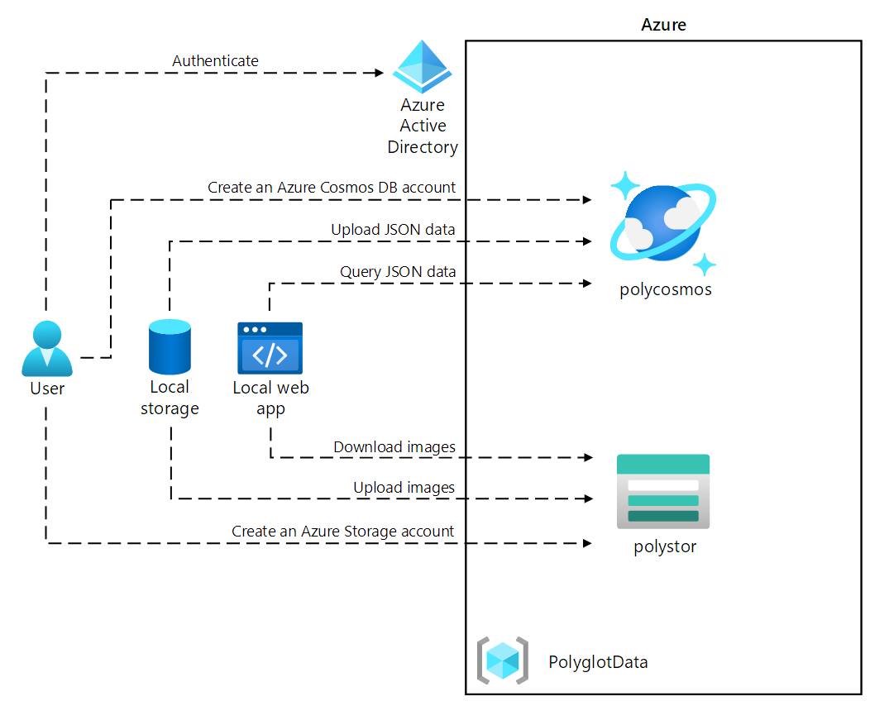

# Lab 04: Construct a polyglot data solution

### Architecture diagram




### 1 Create Azure resources

- resource group
  - name : PolyglotData

- Create an Azure Cosmos DB Core SQL
  - name : polycosmoskie
  - Capacity mode : Serverless

- Create an Azure Storage account
  - name : polystorkie
  - Redundancy : LRS


### 2 Review and upload data

goto DataStorage > Containers > + container
create container name : images
Public access level : Select Blob (anonymous read access for blobs only)

In  the container upload files in /Images *.jpg

#### Review JSON data

In the ```AdventureWorks\AdventureWorks.Upload```, select models.json, and then select Open with VSCode


#### Create a Cosmos DB database and collection, and perform a JSON data upload

```ps
cd .\AdventureWorks.Upload\
```


add dependency Microsoft.Azure.Cosmos into project 
```ps
dotnet add package Microsoft.Azure.Cosmos --version 3.20.1
```
Open the Program.cs file

enter values 

```c#
...
public class Program
    {
        //Key URI
        private const string EndpointUrl = "https://polycosmoskie.documents.azure.com:443/";
        //PRIMARY KEY
        private const string AuthorizationKey = "xxxx";
        private const string DatabaseName = "Retail";
        private const string ContainerName = "Online";
        private const string PartitionKey = "/Category";
        private const string JsonFilePath = "C:\\Users\\Bokie\\az-204-lab\\04\\AdventureWorks\\AdventureWorks.Upload\\models.json";
        ...
    }
```

```ps
dotnet build
```

Create DB from models.json

```ps
> dotnet run
Creating a database if not already exists...
Creating a container if not already exists...
Preparing 119 items to insert...
Starting...
Finished writing 119 items in 00:00:05.6537166.
```

#### Validate JSON data upload

go to the polycosmoskie On the CosmosDB find Data Explorer

Data Explorer > Retail

try to query following

```sql
SELECT * FROM models
```
Execute Query


Select Execute Query, and then observe the result of the COUNT

```sql
SELECT VALUE COUNT(1) FROM models
```
### 3 Configure a .NET web application

In the AdventureWorks.Web project Open the appsetting.json file

AdventureWorksCosmosContext = "<PRIMARY CONNECTION STRING>"
BlobContainerUrl = "<Settings.BlobContainerUrl>"

```json
{
  "ConnectionStrings": {
    "AdventureWorksCosmosContext": ""
  },
  "Settings": {
    "BlobContainerUrl": ""
  }
}
```

In the ```AdventureWorks.Context``` project 

import Microsoft.Azure.Cosmos from NuGet

```ps
dotnet add package Microsoft.Azure.Cosmos --version 3.20.1
```

```ps
dotnet build
```

#### Configure connectivity to Azure Cosmos DB

```AdventureWorks.Context``` folder node, select New File

name : ```AdventureWorksCosmosContext.cs``` insde code

```c#
//ref model project
using AdventureWorks.Models;

// dependencies from nuget
using Microsoft.Azure.Cosmos;
using Microsoft.Azure.Cosmos.Linq;

//common system
using System;
using System.Collections.Generic;
using System.Linq;
using System.Threading.Tasks;

namespace AdventureWorks.Context
{
    public class AdventureWorksCosmosContext : IAdventureWorksProductContext
    {
        private readonly Container _container;

        //Declare Context DB
        public AdventureWorksCosmosContext(string connectionString, string database = "Retail", string container = "Online")
        {
            _container = new CosmosClient(connectionString).GetDatabase(database).GetContainer(container);


        }

        public async Task<Model> FindModelAsync(Guid id)
        {
            var iterator = _container.GetItemLinqQueryable<Model>().Where(m => m.id == id).ToFeedIterator<Model>();
            List<Model> matches = new List<Model>();
            while (iterator.HasMoreResults)
            {
                var next = await iterator.ReadNextAsync();
                matches.AddRange(next);
            }
            return matches.SingleOrDefault();
        }

        public async Task<List<Model>> GetModelsAsync()
        {
            string query = $@"SELECT * FROM items";
            var iterator = _container.GetItemQueryIterator<Model>(query);
            List<Model> matches = new List<Model>();
            while (iterator.HasMoreResults)
            {
                var next = await iterator.ReadNextAsync();
                matches.AddRange(next);
            }
            return matches;
        }

        public async Task<Product> FindProductAsync(Guid id)
        {
            string query = $@"SELECT VALUE products
                    FROM models
                    JOIN products in models.Products
                    WHERE products.id = '{id}'";
            var iterator = _container.GetItemQueryIterator<Product>(query);
            List<Product> matches = new List<Product>();
            while (iterator.HasMoreResults)
            {
                var next = await iterator.ReadNextAsync();
                matches.AddRange(next);
            }
            return matches.SingleOrDefault();
        }
    }
}
```

#### Review the .NET application startup logic

the ```AdventureWorks.Web``` project.

Open the Startup.cs file.

In the ```Startup.cs```, note the existing ```ConfigureProductService``` method

review ref to context project

```c#
...
public void ConfigureProductService(IServiceCollection services)
{
    services.AddScoped<IAdventureWorksProductContext, AdventureWorksCosmosContext>(provider => 
    new AdventureWorksCosmosContext(_configuration.GetConnectionString(nameof(AdventureWorksCosmosContext))));
}
...
```

#### Validate that the .NET application successfully connects to data stores

```AdventureWorks.Web```

```ps
dotnet run
```

In the open browser window, browse to the currently running web application (http://localhost:5000).


### 4 Clean up your subscription

```ps
az group delete --name PolyglotData --no-wait --yes
```