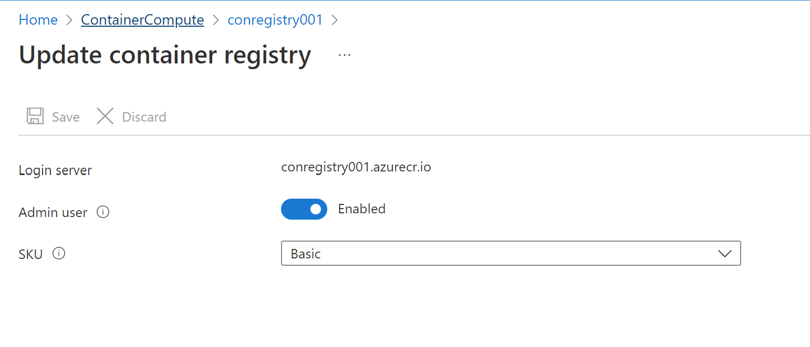

# Lab 05: Deploy compute workloads by using images and containers

### Architecture diagram


### 1 Create a VM by using the Azure Command-Line Interface (CLI)

- create rg
  - name : ContainerCompute
  - region : (US) East US


use The Cloud Shell

check version
```ps
az --version
```

create vm with az cmd

- rg : ContainerCompute
- name : quickvm
- image : Debien
- Admin-Username : student
- Admin-Password : <CreateYourPassword>

optional set subscription

```ps
az account list
az account set --subscription xxxxxxxxxxxxxxxxxxxxxx
```

```ps
az vm create --resource-group ContainerCompute --name quickvm  --image Debien --admin-username student --admin-password P@ssw0rdaz01
```


run following command for see the detail cm

```ps
az vm show --resource-group ContainerCompute --name quickvm
```

list ip addresses

```ps
az vm list-ip-addresses --resource-group ContinerCompute --name quickvm
```

fillter regex
```ps
> az vm list-ip-addresses --resource-group ContainerCompute --name quickvm --query '[].{ip:virtualMachine.network.publicIpAddresses[0].ipAddress}' --output tsv

20.231.102.17
```

Remote via SSH

```ps
ssh student@20.231.102.17
```

get Info in VM

```bash
student@quickvm:~$ uname -a
Linux quickvm 4.19.0-20-cloud-amd64 #1 SMP Debian 4.19.235-1 (2022-03-17) x86_64 GNU/Linux
```


### 2 Create a Docker container image and deploy it to Azure Container Registry

create new folder ipcheck and then cd into ipcheck 

create new project dotnet ipcheck

```ps
> dotnet new console --output . --name ipcheck
The template "Console App" was created successfully.

Processing post-creation actions...
Running 'dotnet restore' on C:\Users\Bokie\az-204-lab\05\ipcheck\ipcheck.csproj...        
  Determining projects to restore...
  Restored C:\Users\Bokie\az-204-lab\05\ipcheck\ipcheck.csproj (in 101 ms).
Restore succeeded.
```

Open Code Editor

```ps
code .
```
1. create dockerfile
2. Copy and Page following code into Program.cs

```c#
public class Program
{
    public static void Main(string[] args)
    {        
        // Check if network is available
        if (System.Net.NetworkInformation.NetworkInterface.GetIsNetworkAvailable())
        {
            System.Console.WriteLine("Current IP Addresses:");
            // Get host entry for current hostname
            string hostname = System.Net.Dns.GetHostName();
            System.Net.IPHostEntry host = System.Net.Dns.GetHostEntry(hostname);
            // Iterate over each IP address and render their values
            foreach(System.Net.IPAddress address in host.AddressList)
            {
                System.Console.WriteLine($"\t{address}");
            }
        }
        else
        {
            System.Console.WriteLine("No Network Connection");
        }
    }
}
```

and then run

```ps
dotnet run
```

for dockerfile copy into Dockerfile

```dockerfile
# Start using the .NET Core 3.1 SDK container image
FROM mcr.microsoft.com/dotnet/sdk:3.1-alpine AS build

# Change current working directory
WORKDIR /app

# Copy existing files from host machine
COPY . ./

# Publish application to the "out" folder
RUN dotnet publish --configuration Release --output out

# Start container by running application DLL
ENTRYPOINT ["dotnet", "out/ipcheck.dll"]
```

### 3 Create a Container Registry resource

check ACR name (verify name before create)

```ps
> az acr check-name --name conregistry001
{
  "message": null,
  "nameAvailable": true,
  "reason": null
```

create acr with az cmd

```ps
az acr create --resource-group ContainerCompute --name conregistry001 --sku Basic
```

Store Container Registry metadata

```ps
az acr list
```
get name
```ps
> az acr list --resource-group ContainerCompute --query "max_by([], &creationDate).name" --output tsv
conregistry001
```

### 5 Deploy a Docker container image to Container Registry

cd into ipcheck 

Run the following command to upload the source code to your container registry and build the container image as a Container Registry task

```ps
az acr build --registry conregistry001 --image ipcheck:latest .
```

Validate your container image in Container Registry

go to the ACR

Service > Repositories > ipcheck 


### 4 Deploy an Azure container instance

```Enable the admin user in Container Registry via update``` in overview > Update




Automatically deploy a container image to an Azure container instance


Create container instance via ACR

- name : managedcompute
- image : ipcheck:latest
- Number of cores : 2
- Memory : 4
- pubip : no


Validate that the container instance ran successfully

On the container instance > settings > container > log


### Clen lab Delete RG

```ps
az group delete --name ContainerCompute --no-wait --yes
```


