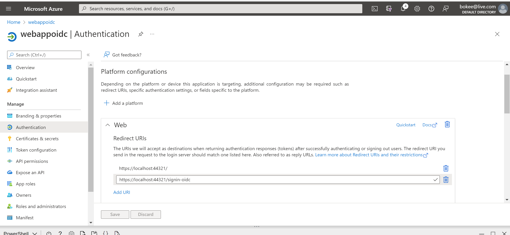
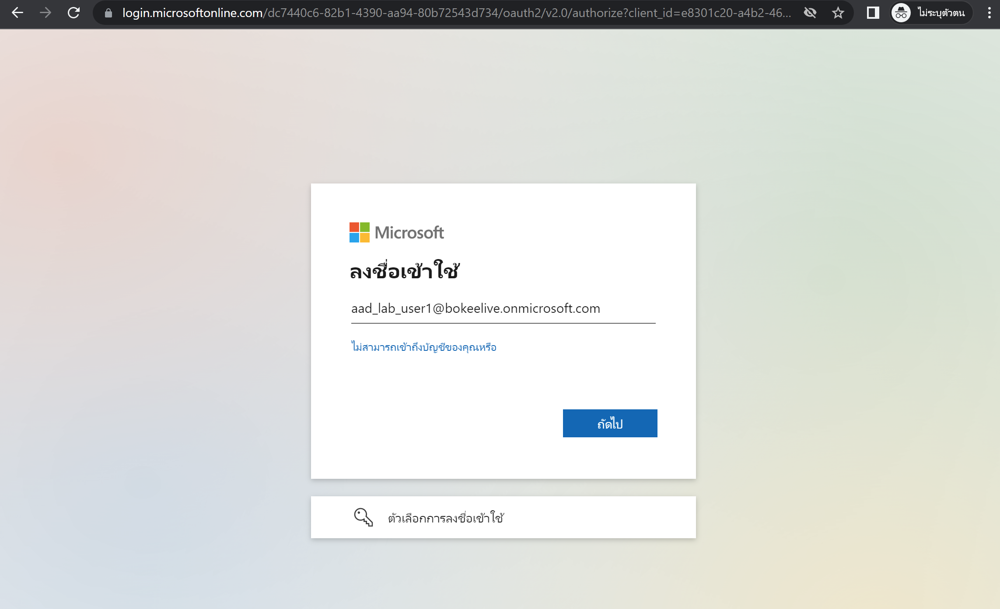
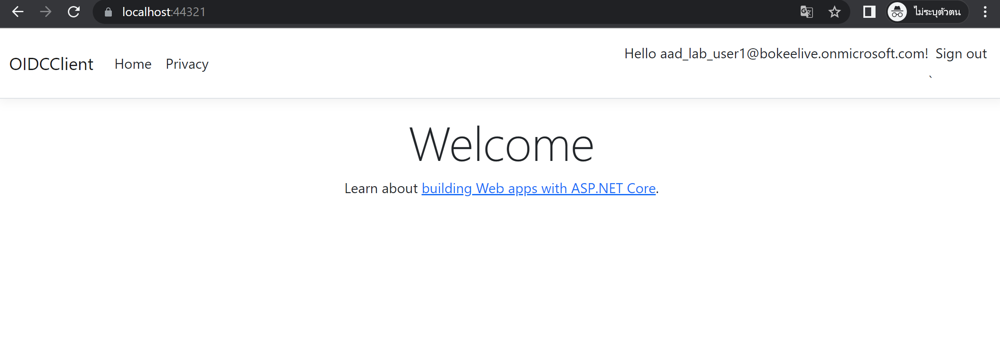
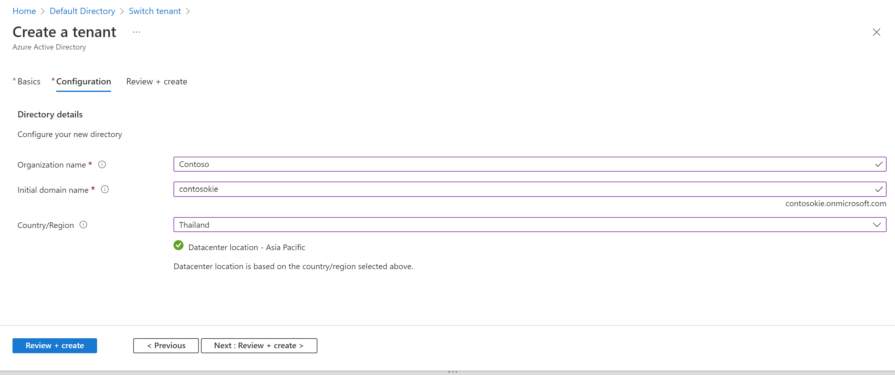
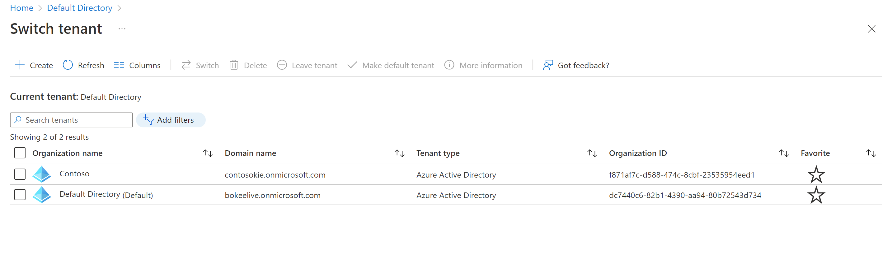
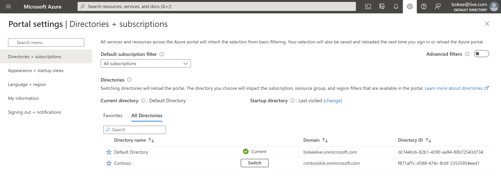

# Lab 06: Authenticate by using OpenID Connect, MSAL, and .NET SDKs

### Architecture diagram


### 1 Configure a single-tenant Azure AD environment

#### Register an application in Azure AD

goto the Azure Active Directory > App registrations > add + New registration


on page Register an application

- Name : webappoidc
- Supportd account types (default - Single tenant)
- Redirect URI : Web


#### Record unique identifiers

in the Overview find and record values Application(client)ID , Directory(tenant)ID 

e8301c20-a4b2-460e-a6d1-de06a6eaa289
dc7440c6-82b1-4390-aa94-80b72543d734

#### Configure the application authentication settings

on the webappoidc select Authenication

+ Add a platform > Web > enter 
- Redirect : https://localhost:44321/
- Front-channel logout URL text box	Enter https://localhost:44321/signout-oidc

- add login for redirect when ms auth page https://localhost:44321/signin-oidc
 




#### Create an Azure AD user

on cloudshell (powershell)

command to retrieve and display the primary Domain Name System (DNS) domain name of the Azure AD tenant
```ps
PS /home/bokee> Connect-AzureAD
PS /home/bokee> $aadDomainName = ((Get-AzureAdTenantDetail).VerifiedDomains)[0].Name
PS /home/bokee> $aadDomainName
bokeelive.onmicrosoft.com
```

commands to create Azure AD users that you’ll use to test Azure AD authentication
```ps
PS /home/bokee> $aadDomainName
bokeelive.onmicrosoft.com
PS /home/bokee> $passwordProfile = New-Object -TypeName Microsoft.Open.AzureAD.Model.PasswordProfile
PS /home/bokee> $passwordProfile.Password = 'Pa55w.rd1234'
PS /home/bokee> $passwordProfile.ForceChangePasswordNextLogin = $false
PS /home/bokee> New-AzureADUser -AccountEnabled $true -DisplayName 'aad_lab_user1' -PasswordProfile $passwordProfile -MailNickName 'aad_lab_user1' -UserPrincipalName "aad_lab_user1@$aadDomainName"

ObjectId                             DisplayName   UserPrincipalName                       UserType
--------                             -----------   -----------------                       --------
a0b8b826-0e78-4b10-9e13-3f254afa95d8 aad_lab_user1 aad_lab_user1@bokeelive.onmicrosoft.com Member

```

command to identify the user principal name (UPN) of the newly created Azure AD user
```ps
PS /home/bokee> (Get-AzureADUser -Filter "MailNickName eq 'aad_lab_user1'").UserPrincipalName
aad_lab_user1@bokeelive.onmicrosoft.com
```

### 2 Create a single-tenant ASP.NET Core web app

#### Create an ASP.NET Core web app project


create and set working dir > az-204-lab\06\OIDCClient

create new project dotnet

```ps
dotnet new mvc --auth SingleOrg --client-id e8301c20-a4b2-460e-a6d1-de06a6eaa289 --tenant-id dc7440c6-82b1-4390-aa94-80b72543d734 --domain bokeelive.onmicrosoft.com
```

open vscode to at OIDCClinet/Properties/launchSettings.json edit for settting port and url on running

- issSettings : sslPort : 44321
- OIDCClient : applicationUrl : https://localhost:44321

```json
{
  "iisSettings": {
    "windowsAuthentication": false,
    "anonymousAuthentication": true,
    "iisExpress": {
      "applicationUrl": "https://localhost:44321",
      "sslPort": 44321
    }
  }
  ...
} 
```

Edit OIDCClient.csproj

```xml
<Project Sdk="Microsoft.NET.Sdk.Web">

  <PropertyGroup>
    <TargetFramework>net6.0</TargetFramework>
    <Nullable>enable</Nullable>
    <ImplicitUsings>enable</ImplicitUsings>
    <UserSecretsId>aspnet-OIDCClient-FC79EB3E-6968-4B44-AB60-294B004A18A0</UserSecretsId>
  </PropertyGroup>

  <ItemGroup>
    <PackageReference Include="Microsoft.AspNetCore.Authentication.JwtBearer" Version="6.0.5" NoWarn="NU1605" />
    <PackageReference Include="Microsoft.AspNetCore.Authentication.OpenIdConnect" Version="6.0.5" NoWarn="NU1605" />
    <PackageReference Include="Microsoft.Identity.Web" Version="1.16.0" />
    <PackageReference Include="Microsoft.Identity.Web.UI" Version="1.16.0" />
  </ItemGroup>

</Project>
```

Navigate to the Views\Shared folder, and then open the _LoginPartial.cshtml file.

replace

```html
@using System.Security.Principal

<ul class="navbar-nav">
@if (User.Identity?.IsAuthenticated == true)
{
        <span class="navbar-text text-dark">Hello @User.Identity?.Name!</span>
        <li class="nav-item">
            <!-- replace -->
            <a class="nav-link text-dark" asp-area="AzureAD" asp-controller="Account" asp-action="SignOut">Sign out</a>`
        </li>
}
else
{
        <li class="nav-item">
            <!-- replace -->
            <a class="nav-link text-dark" asp-area="AzureAD" asp-controller="Account" asp-action="SignIn">Sign in</a>
        </li>
}
</ul>

```

Open the file ```appsettings.json``` and review the content

review AzureAd

```json
{
  "AzureAd": {
    "Instance": "https://login.microsoftonline.com/",
    "Domain": "bokeelive.onmicrosoft.com",
    "TenantId": "dc7440c6-82b1-4390-aa94-80b72543d734",
    "ClientId": "e8301c20-a4b2-460e-a6d1-de06a6eaa289",
    "CallbackPath": "/signin-oidc"
  },
 ...
}
```


select ```Program.cs``` to edit 

review inscope block 

```c#
using Microsoft.AspNetCore.Authentication;
using Microsoft.AspNetCore.Authorization;
using Microsoft.AspNetCore.Authentication.OpenIdConnect;
using Microsoft.AspNetCore.Mvc.Authorization;
using Microsoft.Identity.Web;
using Microsoft.Identity.Web.UI;

var builder = WebApplication.CreateBuilder(args);

// Add services to the container.
builder.Services.AddAuthentication(OpenIdConnectDefaults.AuthenticationScheme)
    .AddMicrosoftIdentityWebApp(builder.Configuration.GetSection("AzureAd"));

builder.Services.AddControllersWithViews(options =>
{
    var policy = new AuthorizationPolicyBuilder()
        .RequireAuthenticatedUser()
        .Build();
    options.Filters.Add(new AuthorizeFilter(policy));
});
builder.Services.AddRazorPages()
    .AddMicrosoftIdentityUI();

var app = builder.Build();
```


#### Test the single-tenant web app in a single-tenant scenario

```ps
dotnet build
```

command to generate a self-signed certificate and configure the local computer to trust it
```ps
> dotnet dev-certs https --trust
Trusting the HTTPS development certificate was requested. A confirmation prompt will be displayed if the certificate was not previously trusted. Click yes on the prompt to trust the certificate.
A valid HTTPS certificate is already present.
```

run

```ps
dotnet run
```

test login

we use user : aad_lab_user1@bokeelive.onmicrosoft.com , passoword : Pa55w.rd1234






## Configure a multitenant Azure AD environment

### Create AZ AD tenant

on AAD blade select Manage tenants and then select +Create






### Create an Azure AD user

in top right conner click Switch directory
select subscription

click Switch 



Open Cloud Shell on this

for this lab my subscription limit 

the steps is seem single tenant but change at AAD muli

https://microsoftlearning.github.io/AZ-204-DevelopingSolutionsforMicrosoftAzure/Instructions/Labs/AZ-204_lab_06.html#exercise-3-configure-a-multitenant-azure-ad-environment


