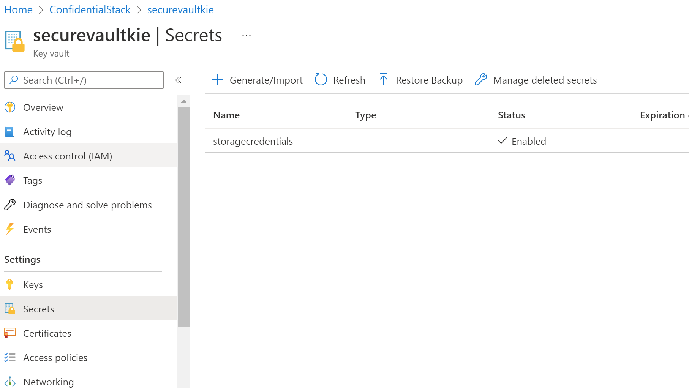
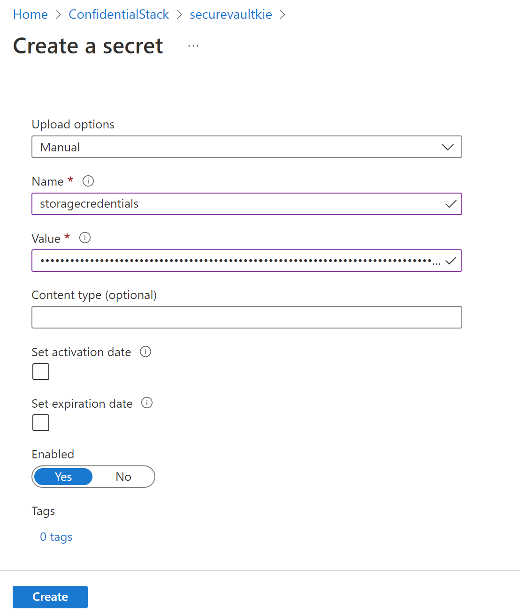
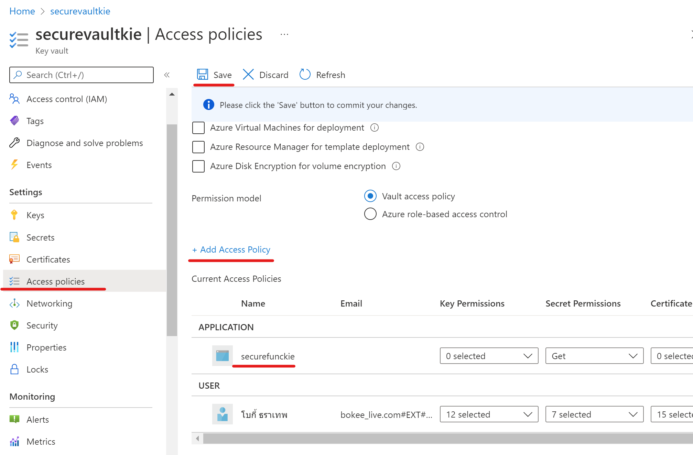
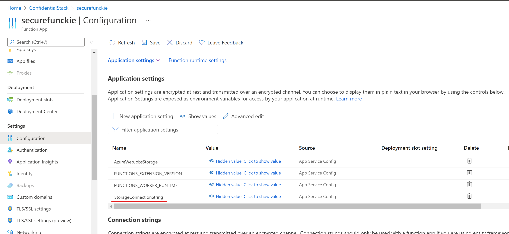

# Lab 07: Access resource secrets more securely across services

Diagram


## Create Azure Resources
- Resource Group
  - name : ConfidentialStack

- Storage account
  - name : securestorkie
  - Performace : standard
  - Redundancy :  LRS

copy Access keys > show key > Connection string : 

```
DefaultEndpointsProtocol=https;AccountName=securestorkie;AccountKey=RiL6IaxQsGFX/F9kqN+CSjVYsRojiJUMaCfeV8NoesyhP4pi7E2eDZbCeMQGZ4zV4b+EekT91yws+AStIF3uJQ==;EndpointSuffix=core.windows.net
```

- Azure Key Vault
  - securevaultkie
  - pricing tier : standard

- Function app
  - securefunckie
  - Publish : code
  - Runtime stack : .NET
  - Hosting : use 
    - Storage account : securestorkie
    - Operating System : Linux
    - Plan type : Consumption (Serverless)

## Configure secrets and identities

In ConfidentialStack > securefunckie

select the Identity > System assigned > Status to On

## Create a Key Vault secret

ConfidentialStack > securevaultkie > Secrets > Settings 

On the Secrets pane, select + Generate/Import.

- Upload options : ```maunal```
- Name : ```storagecredentials```
- Value : ```DefaultEndpointsProtocol=https;AccountName=securestorkie;AccountKey=RiL6IaxQsGFX/F9kqN+CSjVYsRojiJUMaCfeV8NoesyhP4pi7E2eDZbCeMQGZ4zV4b+EekT91yws+AStIF3uJQ==;EndpointSuffix=core.windows.net```





on select version > Serect Indentifier : copy it ```https://securevaultkie.vault.azure.net/secrets/storagecredentials```

## Configure a Key Vault access policy

securevaultkie key vault > Access policies > settings > Add access policy > Add

- Secret permissions : Get
- Select principal : securefunckie




## Create a Key Vault-derived application setting (Add secret in config)

goto the securefunckie > configuration > Application settings > New application setting > Add/Edit application setting 


- Name : StorageConnectionString
- Val : ```@Microsoft.KeyVault(SecretUri=https://securevaultkie.vault.azure.net/secrets/storagecredentials)```




## Build an Azure Functions app

goto 07\Starter\func

crete func with cmd

```ps
 func init --worker-runtime dotnet --force
```

and then build

```ps
dotnet build
```

## Create an HTTP-triggered function

Azure Functions Core Tools to create a new function named FileParser using the HTTP trigger template

```ps
 func new --template "HTTP trigger" --name "FileParser"
```

open the ```local.settings.json``` file

Update this file 

```json
{
    "IsEncrypted": false,
    "Values": {
        "AzureWebJobsStorage": "UseDevelopmentStorage=true",
        "FUNCTIONS_WORKER_RUNTIME": "dotnet",
        "StorageConnectionString": "[TEST VALUE]"
    }
}
```

on ```FileParser.cs``` review & Delete all of the content within the FileParser.cs file


replace below
```c# 
 using Microsoft.AspNetCore.Mvc;
 using Microsoft.Azure.WebJobs;
 using Microsoft.AspNetCore.Http;
 using System;
 using System.Threading.Tasks;
 public static class FileParser
 {
     [FunctionName("FileParser")]
     public static async Task<IActionResult> Run(
         [HttpTrigger("GET")] HttpRequest request)
     {
         string connectionString = Environment.GetEnvironmentVariable("StorageConnectionString");
         return new OkObjectResult(connectionString);
     }
 }
```

Run the following command to run the function app project

```ps
func start --build
```

test func with http will get value env StorageConnectionString

> http://localhost:7071/api/fileparser


## Deploy the function using the Azure Functions Core Tools

login
```ps
az login
```

set subcription 
```ps
az account set --subscription 1d00f364-f62c-4896-a77d-e24d36e7d9c8
```

deploy
```ps
func azure functionapp publish securefunckie
```

## Test the Key Vault-derived application setting

goto the securefunckie > Function App > Functions

select FileParser test


## Access Azure Blob Storage data

securestorkie
on Storage account > Containers >  Data storage > + Container

- name : drop
- Public access level :  Blob (anonymous read access for blobs only).

Upload file :  records.json


try to access json > https://securestorkie.blob.core.windows.net/drop/records.json

and then change access lv to Private(no anonymous access)

## Pull and configure the Azure SDK for .NET

in fun proj

add version 12.6.0 of the Azure.Storage.Blobs package from NuGet:
```ps
 dotnet add package Azure.Storage.Blobs --version 12.6.0
```

and then add using in FileParser.cs file

```c#
 using Azure.Storage.Blobs;
 using Microsoft.AspNetCore.Mvc;
 using Microsoft.Azure.WebJobs;
 using Microsoft.AspNetCore.Http;
 using System;
 using System.Threading.Tasks;
 public static class FileParser
 {
     [FunctionName("FileParser")]
     public static async Task<IActionResult> Run(
         [HttpTrigger("GET")] HttpRequest request)
     {
         string connectionString = Environment.GetEnvironmentVariable("StorageConnectionString");
         BlobClient blob = new BlobClient(connectionString, "drop", "records.json");
         var response = await blob.DownloadAsync();
         return new FileStreamResult(response?.Value?.Content, response?.Value?.ContentType);
     }
 }
```

deploy again

```ps
func azure functionapp publish securefunckie
```

for test https://securefunckie.azurewebsites.net/api/FileParser?code=d4INC8VvA2UAvKEKcVXjiRPvGeBQ2MSUC7Rdtki020MDAzFulvXs3g==


## Clean lab

```ps
az group delete --name ConfidentialStack --no-wait --yes
```


