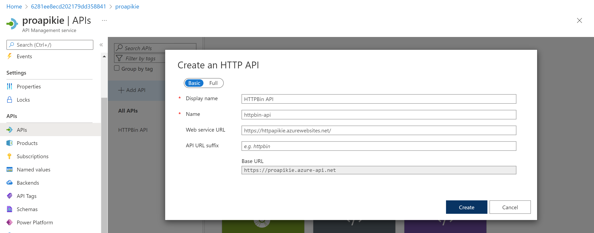

# Create a multi-tier solution by using Azure services

Diagram


## Create an Azure App Service resource by using a Docker container image (httpbin container image)

- resoruce group name : ApiService
- name : httpapikie
- publish : Docker Container
- OS : Linux
- ASP : create new
  - name : ApiPlan
- SKU : S1
- Docker : 
  - Option : Single Container
  - Image Source : Docker Hub
  - Access Type : Public
  - Image : kennethreitz/httpbin:latest

## Test the httpbin web application

goto https://httpapikie.azurewebsites.net/

within the webapp select  ```Response formats``` > html > try it out > execute ```review Response body and Header```


within the webapp , select ```Dynamic data``` > GET /byte/{n} > enter 25 > execute ```review Response body and Header```


within the webapp , select ```Status codes``` > GET /status/{codes} > code : enter 404 > execute ```review Server Response```


## Build an API proxy tier by using Azure API Management

Create APIM
- name : proapikie
- Org name : Contoso
- Admin email : admin@contoso.com
- Pricing tier : Consumption (99.95% SLA)


## Define a new API

on the APIs Create a blank API
- Display name : HTTPBin API
- Name : httpbin-api
- Web service URL : https://httpapikie.azurewebsites.net/



on the ```Design``` tab, select ```+ Add operation```

- Display name : Echo Headers
- Name : echo-headers
- Url : GET
- URL : /


```Inbound Add policy (Inbound processing)```
- Name : source
- Value : Add Value , azure-api-mgmt
- Action : append


```Backend``` select the pencil icon.

- Service URL section : Override
- Service URL text box : 
  - https://httpapikie.azurewebsites.net > change to > https://httpapikie.azurewebsites.net/headers


## Test API and Review Overwide Header


## Manipulate an API response

in the Design tab, select ```+ Add operation```.

- Display name : Get Legacy Data
- Name : get-legacy-data
- URL : GET
- URL : /xml

and then test https://proapikie.azure-api.net/xml


Add policy > Outbound processing > select the ```Other policies``` tile

Replace that block of XML with the following XML

outbound XML to JSON

```xml
<outbound>
    <base />
    <xml-to-json kind="direct" apply="always" consider-accept-header="false" />
</outbound>
```


Review the results of the API request

https://proapikie.azure-api.net/xml


On the Design tab, select + Add operation

- Display name : Generate Payload
- Name :  generate-payload
- URL list : GET
- URL text box	: /bytes/{n}.
Template parameters section	In the TYPE text box, enter int.


Outbound processing tile, select + Add policy > Validate content
limit size payload

- Unspecified content type action : 
- Maximum payload size (in bytes) : 128
- Size exceeded action : Prevent
- Errors variable name : validationErrors


!! APIM BUG?? cannot limit all size

### Manipulate an API request

Add operation section

- Display name : Modify Status Code
- Name text box : modify-status-code
- URL list : GET
- URL text box : /status/404


In the Add inbound policy section, select the ```Rewrite URL```


test before rewrite


Rewriting 


test after rewrited


## Clean lab

```ps
az group delete --name ApiService --no-wait --yes
```


