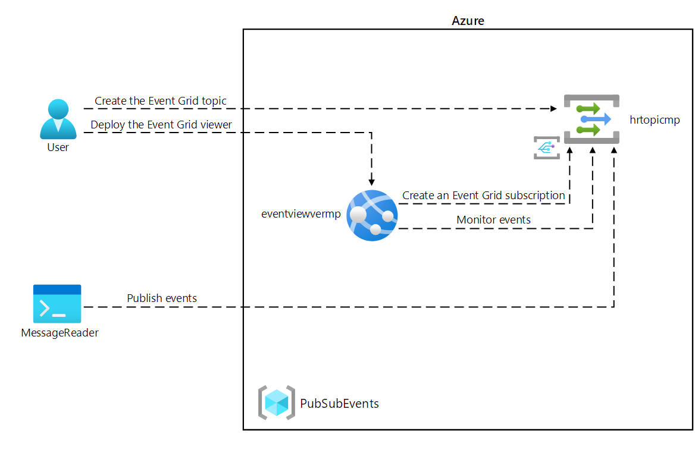

# Lab 09: Publish and subscribe to Event Grid events

## diagram




## Review the Microsoft.EventGrid provider registration

command to get a list of the commands that are available for resource providers
```ps
az provider --help
```

to list all currently registered providers
```ps
az provider list
```

command to list just the namespaces of the currently registered providers

```ps
az provider list --query "[].namespace"
```

## Create a custom Event Grid topic

- RG : PubSubEvents
- Name : hrtopickie
- Advanced tab, select : Event Schema


## Deploy the Azure Event Grid viewer to a web app

Create a resource > Web App

- Name : eventviewerkie
- Publish : Docker Container
- OS : Linux
- ASP : EventPlan
- Docker
  - Single Container
  - DockerHub
  - Public
  - microsoftlearning/azure-event-grid-viewer:latest


## Create an Event Grid subscription
Access the Event Grid Viewer web application

on the webapp eventviewerkie > setting > properties

In the Properties section, record the value of the URL link

URL link : ```eventviewerkie.azurewebsites.net```


## Create a new subscription


On the Event Grid Topic (```hrtopickie```), select + Event Subscription


- Name : basicsub
- Event Schema : Event Grid Schema
- Endpoint Type : Web hooks
- Endpoint : select endpoint > enter url webapp prefix : 
```https://eventviewerkie.azurewebsites.net/api/updates```


## Observe the subscription validation event

goto webapp viewer page :  https://eventviewerkie.azurewebsites.net/


## Record subscription credentials

- Topic Endpoint
:
https://hrtopickie.eastus-1.eventgrid.azure.net/api/events

goto the Settings > Access keys > record the value of the Key1

key1 : FvddUzF/2ksRU2pZxLauBqT+wkAh+29nmVaihEhLS24=


## Publish Event Grid events from .NET

Current directory lib : EventPublisher

create new .Net project

```ps
dotnet new console --name EventPublisher --output .
```

import lib ```Azure.Messaging.EventGrid``` from NuGet

```ps
dotnet add package Azure.Messaging.EventGrid --version 4.1.0
```

Build project

```ps
dotnet build 
```

## Modify the Program class to connect to Event Grid

Program.cs
```c#
using System;
using System.Threading.Tasks;
using Azure;
using Azure.Messaging.EventGrid;
public class Program
{
    private const string topicEndpoint = "https://hrtopickie.eastus-1.eventgrid.azure.net/api/events";
    private const string topicKey = "FvddUzF/2ksRU2pZxLauBqT+wkAh+29nmVaihEhLS24=";


    public static async Task Main(string[] args)
    {
        Uri endpoint = new Uri(topicEndpoint);
        AzureKeyCredential credential = new AzureKeyCredential(topicKey);
        EventGridPublisherClient client = new EventGridPublisherClient(endpoint, credential);
        
        EventGridEvent firstEvent = new EventGridEvent(
            subject: $"New Employee: Alba Sutton",
            eventType: "Employees.Registration.New",
            dataVersion: "1.0",
            data: new
            {
                FullName = "Alba Sutton",
                Address = "4567 Pine Avenue, Edison, WA 97202"
            }
        );
        EventGridEvent secondEvent = new EventGridEvent(
            subject: $"New Employee: Alexandre Doyon",
            eventType: "Employees.Registration.New",
            dataVersion: "1.0",
            data: new
            {
                FullName = "Alexandre Doyon",
                Address = "456 College Street, Bow, WA 98107"
            }
        );
        await client.SendEventAsync(firstEvent);
        Console.WriteLine("First event published");
        
        await client.SendEventAsync(secondEvent);
        Console.WriteLine("Second event published");
    }
}
```

run this project

```ps
dotnet run
```


## Clean up your subscription

```ps
az group delete --name PubSubEvents --no-wait --yes
```


