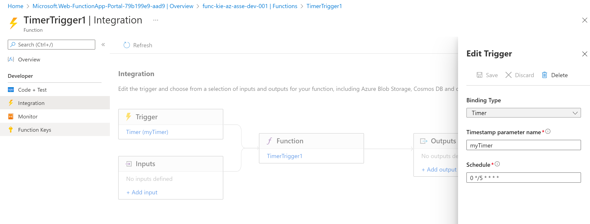
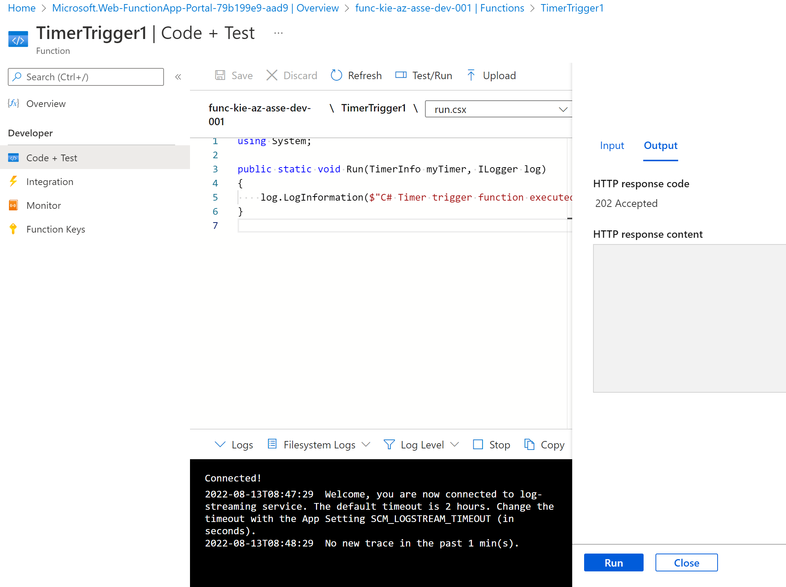

# Create a timer trigger

In this exercise, you will create an Azure function app that's invoked every 20 seconds using a timer trigger.


create the function and select template that ```Timer trigger```


click inside the TimerTrigger1 at the Developer click integration and edit Trigger change to Schdule to every 20 min



```cron
0 */20 * * * *
```

## for Run and test

code will be execute this block and run outout at console

```c#
using System;

public static void Run(TimerInfo myTimer, ILogger log)
{
    log.LogInformation($"C# Timer trigger function executed at: {DateTime.Now}");
}
```

