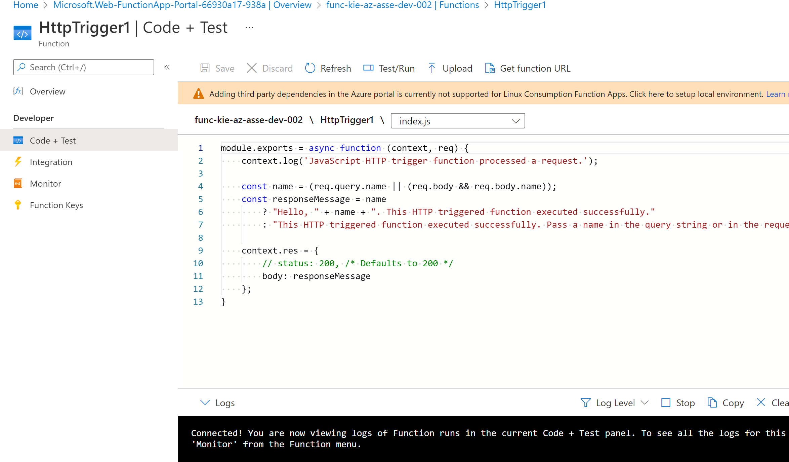

# Explore input and output binding types

## Create a function

1. In the Function App menu on the left, under Functions, select Functions. The Functions pane for your Function App appears.

2. In the command bar, select Create. The Create function pane appears.

3. In the Select a template section, select the``` HTTP trigger``` template.

4. In the Template details section, confirm the following settings. (default)
- New Function : HttpTrigger1
- Authorization level : Function

5. Get function URL : https://func-kie-az-asse-dev-002.azurewebsites.net/api/HttpTrigger1?code=PjpPLioLyVOpiMFR5K1vfv86JcChKTPR4JdcPVcoN9qmAzFu8aUtrw==

try to sending params name https://func-kie-az-asse-dev-002.azurewebsites.net/api/HttpTrigger1?code=PjpPLioLyVOpiMFR5K1vfv86JcChKTPR4JdcPVcoN9qmAzFu8aUtrw==```&name=Joe```


The Code + Test pane for your function appears, and displays the contents of your ```index.js``` file

focus on the code NodeJS in variable name if send param name into function will be return http respose this

```javascript
module.exports = async function (context, req) {
    context.log('JavaScript HTTP trigger function processed a request.');

    const name = (req.query.name || (req.body && req.body.name));
    const responseMessage = name
        ? "Hello, " + name + ". This HTTP triggered function executed successfully."
        : "This HTTP triggered function executed successfully. Pass a name in the query string or in the request body for a personalized response.";

    context.res = {
        // status: 200, /* Defaults to 200 */
        body: responseMessage
    };
}
```

response body

```body
Hello, Joe. This HTTP triggered function executed successfully.
```

Let's look briefly at the function's other file--the ```function.json``` config file. Access this file by selecting function.json from the dropdown list in the filepath above the code block.`` The configuration data`` is shown in the following JSON listing.

```json
{
  "bindings": [
    {
      "authLevel": "function",
      "type": "httpTrigger",
      "direction": "in",
      "name": "req",
      "methods": [
        "get",
        "post"
      ]
    },
    {
      "type": "http",
      "direction": "out",
      "name": "res"
    }
  ]
}
```

