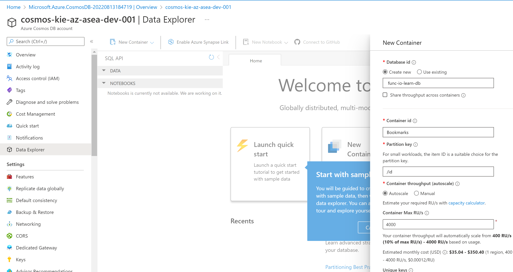
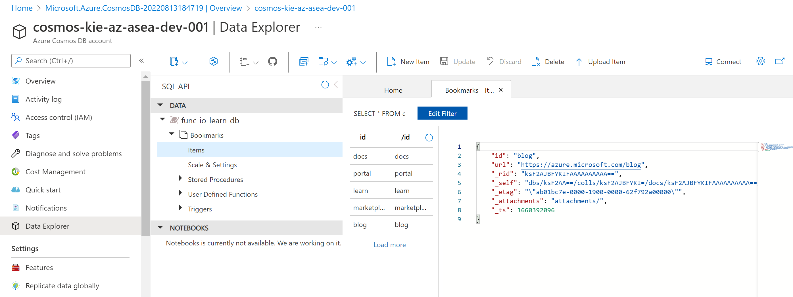
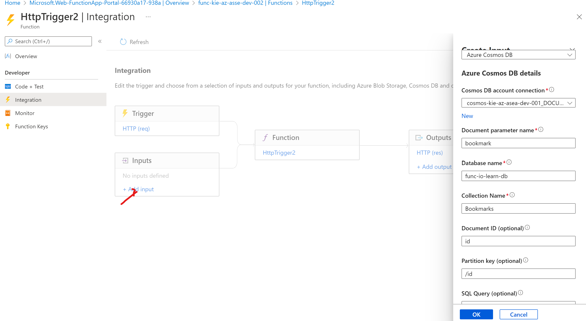
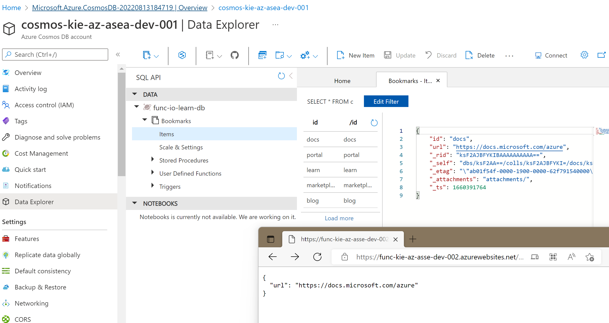

# Read data with input bindings


## Azure Cosmos DB

create Azure Cosmos DB for Core SQL

## add a container

In an Azure Cosmos DB, a container is used to store various user-generated entities, also called items. We'll create a container called Bookmarks.

Let's use the Data Explorer tool to create a database and container.

1. In your Azure Cosmos DB account menu, select Data Explorer on the left. The Data Explorer pane for your Cosmos DB account appears.

2. Select the New Container box. The New Container pane appears. You may need to scroll to the right to see it.

3. Enter the following values for each setting.

- Database id :  func-io-learn-db
- Container id : Bookmarks



## Add test data

1. Expand the func-io-learn-db database and the Bookmarks container, and then select Items. The Items tab appears.

2. In the command bar, select New Item.

3. Replace the default code of the new item with the following JSON code.

```json
{
    "id": "docs",
    "url": "https://docs.microsoft.com/azure"
}
```

- ```_rid```	Resource ID is a unique identifier that is also hierarchical per the resource stack on the resource model. It's used internally for placement and navigation of the item resource.
- ```_self```	Unique addressable URI for the resource.
- ```_etag```	Required for optimistic concurrency control.
- ```_attachments```	Addressable path for the attachments resource.
- ```_ts```	Timestamp of the last update of this resource.

add mores

```json
{
    "id": "portal",
    "url": "https://portal.azure.com"
}
```

```json
{
    "id": "learn",
    "url": "https://docs.microsoft.com/learn"
}
```

```json
{
    "id": "marketplace",
    "url": "https://azuremarketplace.microsoft.com/marketplace/apps"
}
```

```json
{
    "id": "blog",
    "url": "https://azure.microsoft.com/blog"
}
```



## Create your function

go to the function and then create new function that select ```HTTP trigger.```

## Verify the function

In the command bar, select ```Get Function Url```. The Get Function Url 

query string value &name=<your name> to the end of the URL, replacing <your name>

https://func-kie-az-asse-dev-002.azurewebsites.net/api/HttpTrigger2?code=WNZ_vLyBy48A9DRtAXJRs3GtCqPlBSOpfURHWczuZrrEAzFuoSNWMg==&name=Bokie

response body

```response
Hello, Bokie. This HTTP triggered function executed successfully.
```

## Add an Azure Cosmos DB input binding

select Integration => Inputs > select ```Add input```. The Create Input

Binding Type dropdown list, select ```Azure Cosmos DB```

Cosmos DB account connection setting, select the New link 

Create Input

ps can use connection sting cosmosdb



## Update the function implementation

1. In the Function menu for your HttpTrigger2 function, select Code + Test. The Code + Test pane appears for your HttpTrigger2 function.

2. Replace all code in the ```index.js``` file with the following code.

```javascript
module.exports = function (context, req) {

    var bookmark = context.bindings.bookmark

    if(bookmark){
        context.res = {
        body: { "url": bookmark.url },
        headers: {
            'Content-Type': 'application/json'
        }
        };
    }
    else {
        context.res = {
            status: 404,
            body : "No bookmarks found",
            headers: {
            'Content-Type': 'application/json'
            }
        };
    }

    context.done();
};
```

## Modify your function's JSON implementation code

1. Select function.json from the dropdown list in your <functionapp> \ HttpTrigger2 \ path.

2. Modify the values for ```id``` and ```partitionKey``` so that they accept a parameter of ```{id}```. Your ```function.json``` code should resemble the following example, where your-database is replaced with the name of your Cosmos DB database.

```json
{
  "bindings": [
    {
      "authLevel": "function",
      "type": "httpTrigger",
      "direction": "in",
      "name": "req",
      "methods": [
        "get",
        "post"
      ]
    },
    {
      "type": "http",
      "direction": "out",
      "name": "res"
    },
    {
      "connectionStringSetting": "con",
      "name": "bookmark",
      "databaseName": "func-io-learn-db",
      "collectionName": "Bookmarks",
      "id": "{id}",
      "partitionKey": "{id}",
      "direction": "in",
      "type": "cosmosDB"
    }
  ]
}
```


## Try it out

send param query id=docs
- docs
- portal
- learn
- marketplace
- blog

https://func-kie-az-asse-dev-002.azurewebsites.net/api/HttpTrigger2?code=WNZ_vLyBy48A9DRtAXJRs3GtCqPlBSOpfURHWczuZrrEAzFuoSNWMg==&id=docs


will return data inside cosmosdb

