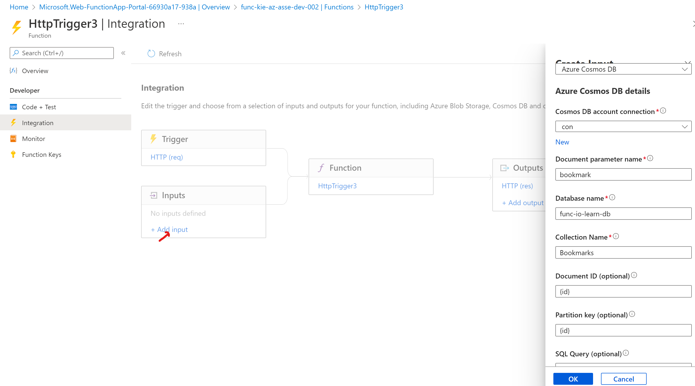
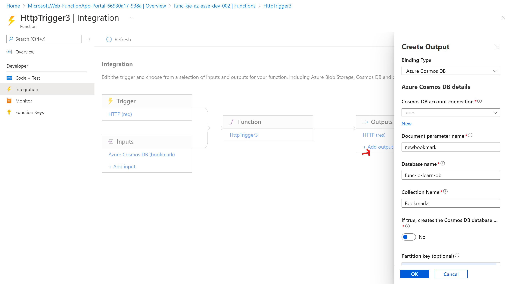
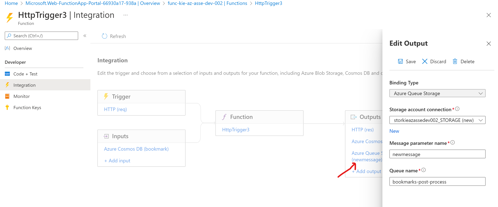
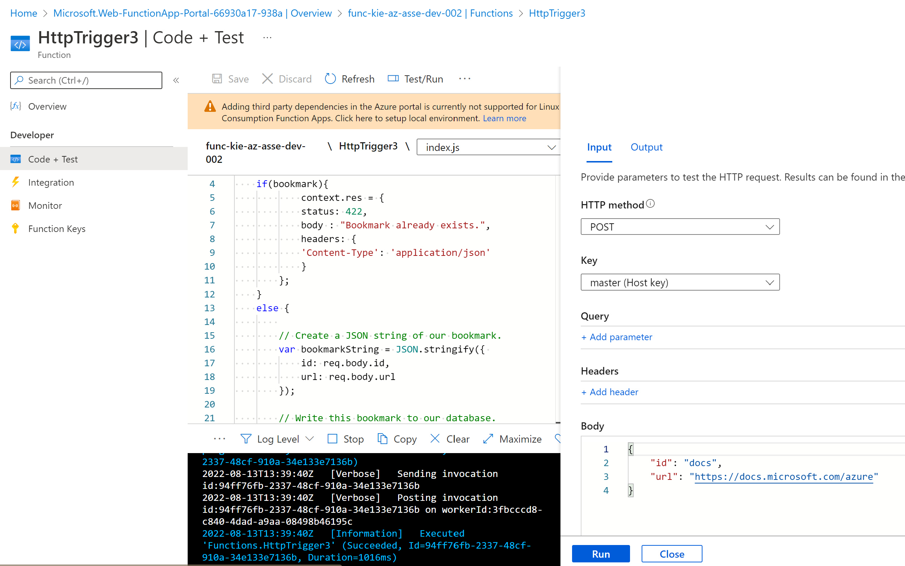
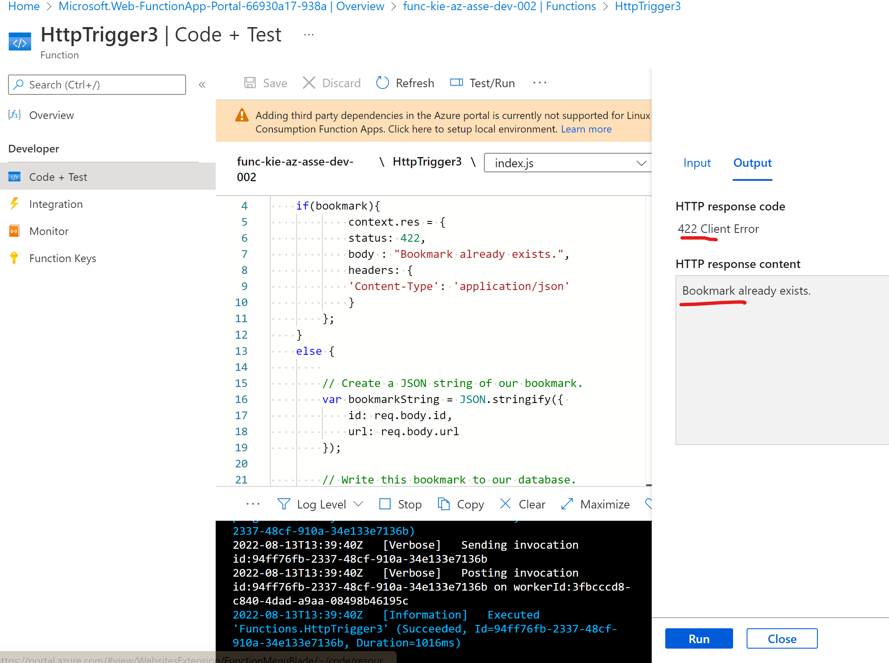
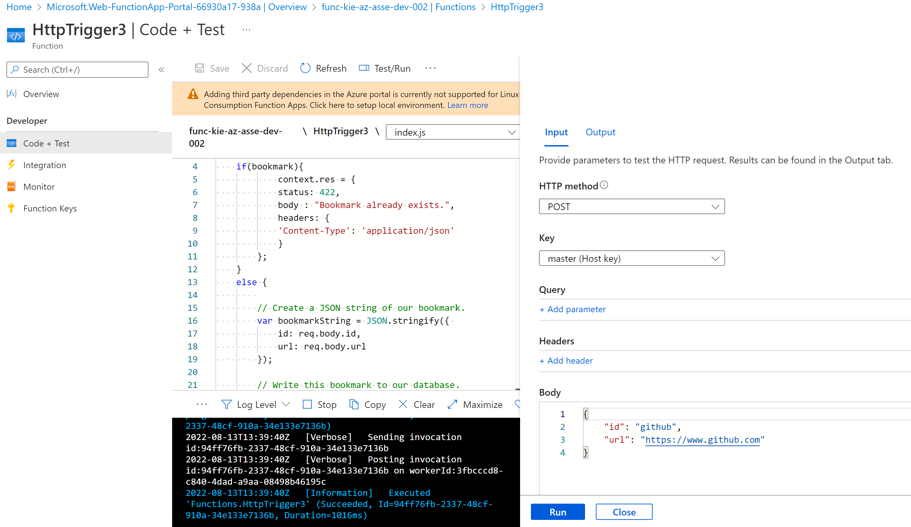
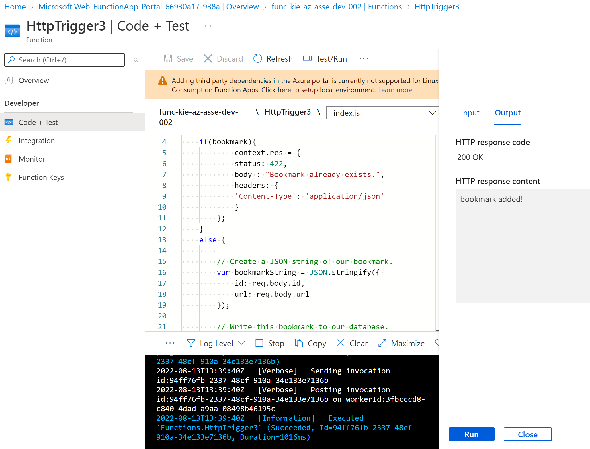
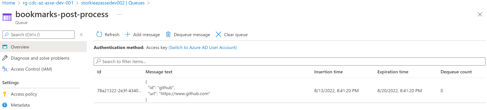

# Write data with output bindings

In the previous exercise, we implemented a scenario to look up bookmarks in an Azure Cosmos DB database. We configured an input binding to read data from our bookmarks collection. But, we can do more. Let's expand the scenario to include writing. Consider the following flowchart:


## Create an HTTP-triggered function

Select a template section, select HTTP trigger, and then select Create. The Overview pane for the ```HttpTrigger3```

## Add an Azure Cosmos DB input binding

In the ```HttpTrigger3``` Function menu, select Integration. The ```Integration``` pane

Add input. The Create Input

Binding Type dropdown list, select ```Azure Cosmos DB```.

 Cosmos DB account connection setting should be pre-populated with ``the connection you created in the previous exercise``.

enter value follwing



## Add an Azure Cosmos DB output binding

In the Integration pane for ```HttpTrigger3```, in the Outputs box, select Add output. The ```Create Output```

Binding Type, from the dropdown list, select ```Azure Cosmos DB```



Now we have a binding to read from our collection, and a binding to write to it.

## Add an Azure Queue Storage output binding


In this example, you see that a function named add-bookmark adds messages to a queue, and another named gen-qr-code pops messages from the same queue, and processes the request. Because we write, or push, messages to the queue from add-bookmark, we'll add a new output binding to your solution.

Let's create the binding through the portal.

On the Integration pane for your function, in the Outputs box, select ```Add output```. The ```Create Output```

In Binding Type dropdown list, select ```Azure Queue Storage```

Under ```Storage account connection```, select ```New```. The New Storage Account connection

Azure Queue Storage details
- Storage account connection : the exsiting storage account
- Message parameter name : newmessage
- Queue name : bookmarks-post-process



## Update function implementation

To open the ```index.js``` file in the code editor, select your function, ```HttpTrigger3```

edit it.

```javascript
module.exports = function (context, req) {

    var bookmark = context.bindings.bookmark;
    if(bookmark){
            context.res = {
            status: 422,
            body : "Bookmark already exists.",
            headers: {
            'Content-Type': 'application/json'
            }
        };
    }
    else {
        
        // Create a JSON string of our bookmark.
        var bookmarkString = JSON.stringify({ 
            id: req.body.id,
            url: req.body.url
        });

        // Write this bookmark to our database.
        context.bindings.newbookmark = bookmarkString;

        // Push this bookmark onto our queue for further processing.
        context.bindings.newmessage = bookmarkString;

        // Tell the user all is well.
        context.res = {
            status: 200,
            body : "bookmark added!",
            headers: {
            'Content-Type': 'application/json'
            }
        };
    }
    context.done();
};
```

## Try it out

1. In command bar of the ```Code + Test``` pane for your ```HttpTrigger3``` function, select Test/Run.
2. In the HTTP method dropdown list, verify that ```POST``` is selected.
3. Replace the contents of the request Body with the following JSON object:

    ```json
    {
        "id": "docs",
        "url": "https://docs.microsoft.com/azure"
    }
    ```
    

4. Select Run.
5. The programmatic progress shows in the Logs pane. When completed, verify that the Output tab displays "Bookmark already exists." in the HTTP response content setting.

    

6. Let's post a second bookmark to the database. Select the Input tab.
7. Replace the contents of the request Body with the following JSON object:

    ```json
    {
        "id": "github",
        "url": "https://www.github.com"
    }
    ```

    

8. Select Run.

9. Verify that the Output tab displays "bookmark added!" in the HTTP response content, as shown in the following screenshot.

    

## Verify that a message is written to the queue

- storage accounts


- 
