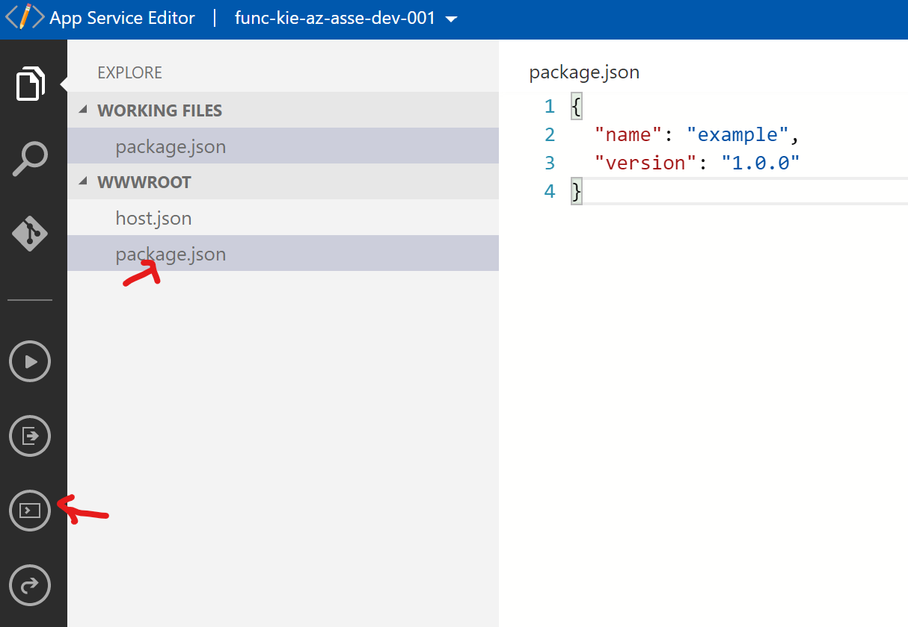
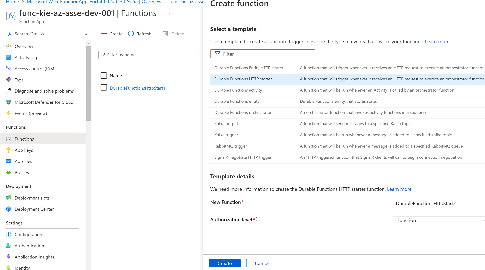

# Create a workflow using Durable Functions

you'll use the example scenario from the previous unit to learn how to create an approval workflow in the Azure portal using Durable Functions.

## Create a Function App

- Publish : Code
- Runtime stack : Node.js
- Version	12 LTS
- Operating System	Windows
- Plan type	Consumption (Serverless)

# Install the durable-functions npm package

1. select function app at Development Tools => App Service Editor, then select Go.
2. In the left menu , WWWROOT folder.
3. Open Console icon
4.Create a new package.json
 > touch package.json
 > open package.json

 Add the following code.
 
```json
{
  "name": "example",
  "version": "1.0.0"
}
```



5. Switch back to the Azure portal. and go to Development Tools, select Console open it.

```cmd
npm install durable-functions
```


6. Restart function


## Create the client function for submitting a design proposal

1. Create function > select template HTTP > ```Durable Functions HTTP starter``` in Filter , name ```HttpStart```



2. Code + test , in index.js

```javascript
const df = require("durable-functions");

module.exports = async function (context, req) {
    const client = df.getClient(context);
    const instanceId = await client.startNew(req.params.functionName, undefined, req.body);

    context.log(`Started orchestration with ID = '${instanceId}'.`);

    return client.createCheckStatusResponse(context.bindingData.req, instanceId);
};
```

3. function.json to view the bindings associated

```json
{
  "bindings": [
    {
      "authLevel": "function",
      "name": "req",
      "type": "httpTrigger",
      "direction": "in",
      "route": "orchestrators/{functionName}",
      "methods": [
        "post",
        "get"
      ]
    },
    {
      "name": "$return",
      "type": "http",
      "direction": "out"
    },
    {
      "name": "starter",
      "type": "orchestrationClient",
      "direction": "in"
    }
  ]
}
```

## Create the orchestrator function

1. create new template```Durable Functions orchestrator``` and entrer name : ```OrchFunction```

2. index.js replace following code

```javascript
const df = require("durable-functions");

module.exports = df.orchestrator(function* (context) {
    const outputs = [];

    /*
    * We will call the approval activity with a reject and an approved to simulate both
    */

    outputs.push(yield context.df.callActivity("Approval", "Approved"));
    outputs.push(yield context.df.callActivity("Approval", "Rejected"));

    return outputs;
});
```

## Create the activity function

1.  Select a template, enter ```Durable Functions activity``` and Under Template details,enter ```Approval``` for the name.
2. Replace the existing code with the following code. index.js

```javascript
module.exports = async function (context) {
    return `Your project design proposal has been -  ${context.bindings.name}!`;
};
```

## Verify that the durable functions workflow starts

call via http 

replace {functionName} to name function to call ex. OrchFunction

```link
https://func-kie-az-asse-dev-001.azurewebsites.net/api/orchestrators/OrchFunction?code=_6G5S2GjzCwQnAd0Zbt976v2c2IQWwBFd5sqkq8oCw7pAzFu3mQyKw==
```


response http

```json
{
  "id": "b2c68e39b36a4805b324637cbb1eadcc",
  "statusQueryGetUri": "https://func-kie-az-asse-dev-001.azurewebsites.net/runtime/webhooks/durabletask/instances/b2c68e39b36a4805b324637cbb1eadcc?taskHub=funckieazassedev001&connection=Storage&code=zUHWhqAgACf0KVyMkxW26Hhx1evDioxeDfjCk62QAFLdAzFui5QOXg==",
  "sendEventPostUri": "https://func-kie-az-asse-dev-001.azurewebsites.net/runtime/webhooks/durabletask/instances/b2c68e39b36a4805b324637cbb1eadcc/raiseEvent/{eventName}?taskHub=funckieazassedev001&connection=Storage&code=zUHWhqAgACf0KVyMkxW26Hhx1evDioxeDfjCk62QAFLdAzFui5QOXg==",
  "terminatePostUri": "https://func-kie-az-asse-dev-001.azurewebsites.net/runtime/webhooks/durabletask/instances/b2c68e39b36a4805b324637cbb1eadcc/terminate?reason={text}&taskHub=funckieazassedev001&connection=Storage&code=zUHWhqAgACf0KVyMkxW26Hhx1evDioxeDfjCk62QAFLdAzFui5QOXg==",
  "rewindPostUri": "https://func-kie-az-asse-dev-001.azurewebsites.net/runtime/webhooks/durabletask/instances/b2c68e39b36a4805b324637cbb1eadcc/rewind?reason={text}&taskHub=funckieazassedev001&connection=Storage&code=zUHWhqAgACf0KVyMkxW26Hhx1evDioxeDfjCk62QAFLdAzFui5QOXg==",
  "purgeHistoryDeleteUri": "https://func-kie-az-asse-dev-001.azurewebsites.net/runtime/webhooks/durabletask/instances/b2c68e39b36a4805b324637cbb1eadcc?taskHub=funckieazassedev001&connection=Storage&code=zUHWhqAgACf0KVyMkxW26Hhx1evDioxeDfjCk62QAFLdAzFui5QOXg==",
  "restartPostUri": "https://func-kie-az-asse-dev-001.azurewebsites.net/runtime/webhooks/durabletask/instances/b2c68e39b36a4805b324637cbb1eadcc/restart?taskHub=funckieazassedev001&connection=Storage&code=zUHWhqAgACf0KVyMkxW26Hhx1evDioxeDfjCk62QAFLdAzFui5QOXg=="
}
```

Copy the statusQueryGetUri value, and use your web browser to go to this URL. You should see a response message that resembles the following example.

see response

```json
{"name":"OrchFunction","instanceId":"b2c68e39b36a4805b324637cbb1eadcc","runtimeStatus":"Completed","input":null,"customStatus":null,"output":["Your project design proposal has been -  Approved!","Your project design proposal has been -  Rejected!"],"createdTime":"2022-08-14T07:12:14Z","lastUpdatedTime":"2022-08-14T07:12:15Z"}
```